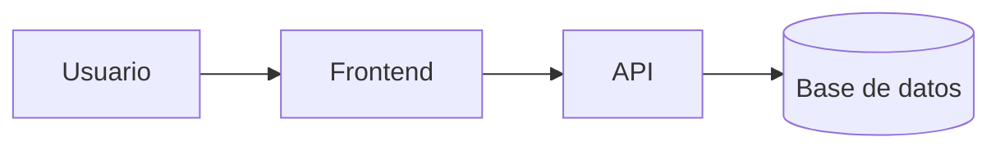

# Sistema de Gestión de Biblioteca


Aplicación web para la gestión, préstamo y reserva de libros en línea. Permite a los usuarios explorar el catálogo disponible y a los administradores gestionar el inventario de la biblioteca de forma eficiente.

## Tabla de contenidos

- [Descripción](#descripción)
- [Instalación](#instalación)
- [Uso](#uso)
- [Estado de funcionalidades](#estado-de-funcionalidades)
- [Tareas pendientes](#tareas-pendientes)
- [Arquitectura](#arquitectura)
- [Contribuidores](#contribuidores)

## Descripción

El sistema optimiza el control de préstamos bibliotecarios, reduciendo tiempos de atención y facilitando el acceso a recursos académicos.

bash
git clone https://github.com/aldoponce-debug/laboratorio-readme.git
cd laboratorio-readme
npm install


## Instalación

```bash
git clone https://github.com/aldoponce-debug/laboratorio-readme.git
cd laboratorio-readme
npm install
```

## Uso

bash
npm start

## Estado de funcionalidades

| Función | Estado |
|---------|--------|
| Catálogo de libros | Listo |
| Préstamos | En progreso |

## Tareas pendientes

- [x] Diseño de base de datos
- [ ] Integración con usuarios

## Arquitectura



## Contribuidores

- **Nombre:** Aldo Emanuel Ponce Cruz 
- **GitHub:** [@aldoponce-debug](https://github.com/aldoponce-debug)
